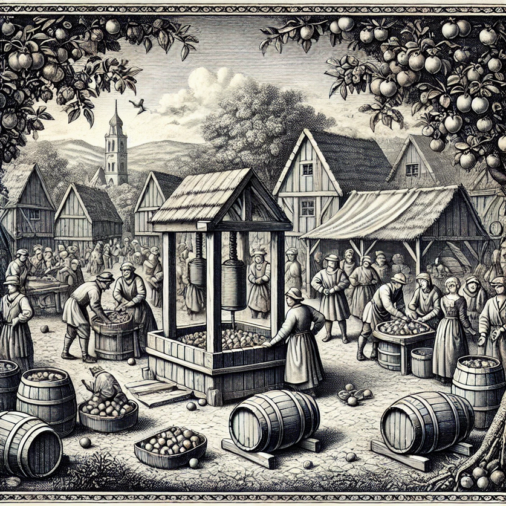

Im Herzen der Region um den Dünsberg wird jedes Jahr das berühmte Apfelweinfest gefeiert – ein Fest, das die Menschen
aus nah und fern zusammenbringt, um die Ernte und das Handwerk der Apfelweinkelterei zu ehren. Die Tradition des Festes
reicht viele Generationen zurück und ist tief mit den landwirtschaftlichen Zyklen und den alten Bräuchen der Region
verwoben.

### Ursprung des Festes

Das Apfelweinfest entstand in den fruchtbaren Tälern rund um den Dünsberg, wo Apfelbäume in großer Zahl gedeihen. Die
Bewohner der Region erkannten früh das Potenzial der saftigen Äpfel, die in den kalten Wintern nicht nur als Nahrung,
sondern auch als Grundlage für den beliebten Apfelwein dienten. Der Beginn des Herbstes, wenn die Apfelernte
abgeschlossen ist und die Kelterei beginnt, markiert den Zeitpunkt des Festes. Es ist ein Dank an die Erde und die
Götter für die reiche Ernte, aber auch eine Gelegenheit, die Gemeinschaft zu stärken. Organisiert wird das Apfelweinfest
jährlich von der Familie der hiesigen Taverne, wo auch rund um das Jahr Apfelwein gelagert und verkauft wird.

### Festlichkeiten und Bräuche

Während des Apfelweinfests verwandelt sich das Dorf in ein lebendiges Zentrum voller Musik, Tanz und Gelächter. Die
Gassen sind geschmückt mit Kränzen aus Apfelzweigen, und große Holzfässer, gefüllt mit frischem Apfelwein, werden auf
dem Marktplatz aufgestellt. Die Dorfbewohner und Besucher genießen die verschiedensten Speisen, die aus den lokalen
Äpfeln zubereitet werden – von herzhaften Gerichten bis hin zu süßen Nachspeisen und trinken natürlich auch den
berühmten Dünsberger Apfelwein, der aus den typischen grauen Keramikkrügen mit blauen Ornamenten in die speziellen
geriffelten Gläser eingeschenkt wird. Ein Höhepunkt ist das **Kelter-Ritual**, bei dem frische Äpfel vor den Augen der
Zuschauer zu Most gepresst werden. Das erste Fass des neuen Apfelweins wird dabei feierlich geöffnet und an alle
Anwesenden ausgeschenkt. Traditionell hält der Bürgermeister von Dünsberg eine Rede, in der er die guten Wünsche für die
kommende Jahreszeit verkündet.

### Wettbewerbe und Musik

Neben dem Keltern ist das Apfelweinfest auch für seine Wettbewerbe bekannt. Ein beliebter Wettkampf ist das
**Apfelwerfen**, bei dem die Teilnehmer ihre Geschicklichkeit unter Beweis stellen müssen, indem sie Äpfel auf
Zielscheiben werfen, wo die Äpfel herunterfallen und anschließend zu Muß verarbeitet werden. Ebenso gibt es den
**Apfelschälwettbewerb**, bei dem es darum geht, die längste Apfelschale ohne Unterbrechung zu schneiden.

Musik spielt eine zentrale Rolle im Festgeschehen. Traditionelle Volkslieder und Tänze werden aufgeführt, begleitet von
lokalen Musikern, die mit Flöten, Geigen und Trommeln für eine ausgelassene Stimmung sorgen. Die Tänze, die oft bis spät
in die Nacht andauern, bringen die Menschen zusammen und sind ein Symbol für den Zusammenhalt und die Freude über die
Ernte.

### Bedeutung des Apfelweinfests

Für die Menschen in der Region um den Dünsberg ist das Apfelweinfest mehr als nur ein Anlass zum Feiern – es ist ein
Fest der Dankbarkeit und der Gemeinschaft. Es verbindet die Menschen mit ihrem Land, ihrer Geschichte und ihren Bräuchen
und erinnert daran, wie wichtig Zusammenarbeit und der Respekt vor der Natur sind. Der Apfelwein, der an diesem Tag im
Überfluss fließt, steht sinnbildlich für die Früchte harter Arbeit und die Fülle, die das Land schenkt.

Das Dünsberger Apfelweinfest ist somit nicht nur eine Tradition, sondern ein lebendiges Erbe, das jedes Jahr aufs Neue
die Herzen der Menschen erfreut und sie für die kommenden Monate stärkt.
