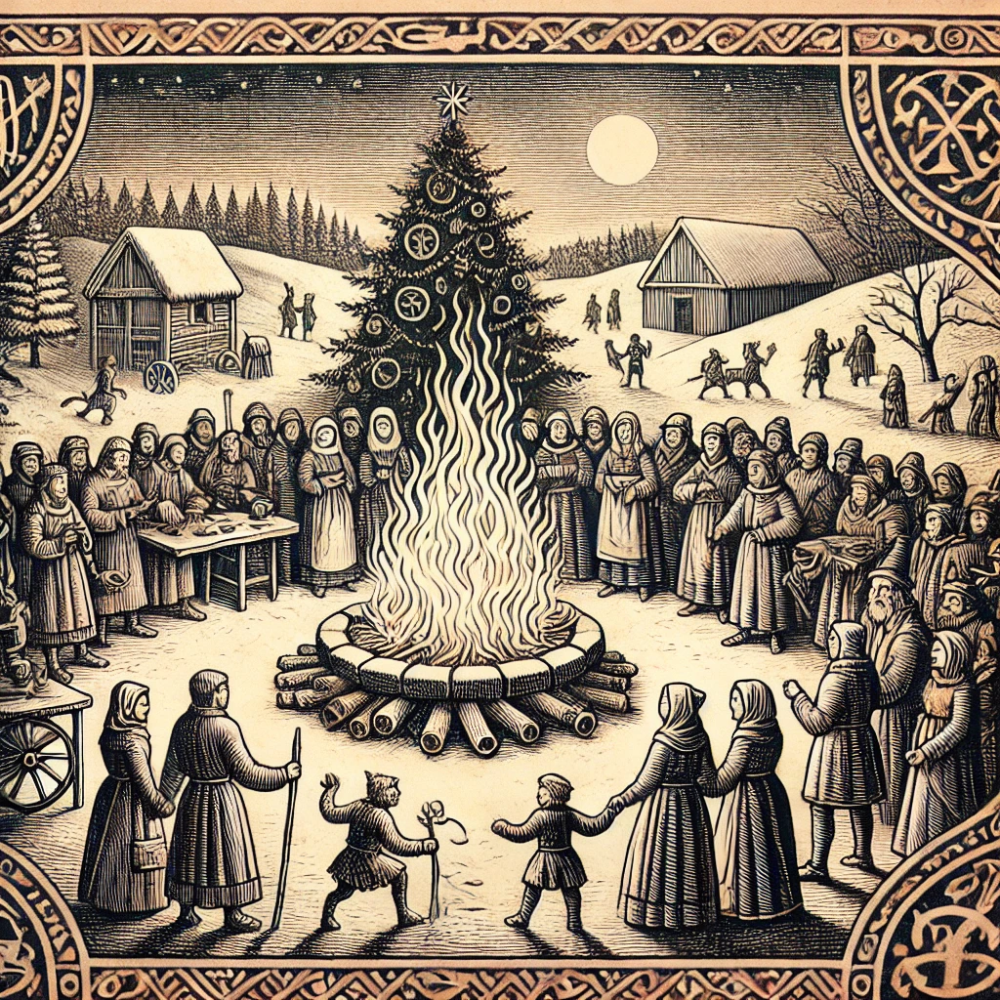

Das Julfest hat seinen Ursprung in einer Zeit, als die ersten Stämme im heutigen Escrigria noch mit der Wildnis rangen
und das Überleben im eisigen Winter alles beherrschte. Die Alten glaubten, dass die Sonne, die im Winter schwächer
wurde, sterben könnte, wenn sie nicht durch Rituale und Opfergaben gestärkt würde. Deshalb begingen sie das Fest in der
tiefsten Nacht des Winters, um die Rückkehr der Sonne zu beschwören. Im Laufe der Jahrhunderte formten Priester und
Druiden, Magier und Krieger das Julfest nach ihren eigenen Glaubensvorstellungen und das Julfest verbreitete sich in
ganz Faergria, aber der Kern des Festes blieb immer derselbe: die Feier des Lichts, das nach der Dunkelheit zurückkehrt,
und die Ehrerbietung an die Ahnen, deren Geister über Faergria wachen.

### Rituale und Bräuche

Während des Julfestes erstrahlen die Dörfer und Städte von Faergria in magischem Licht. Man entzündet riesige Feuer, die
sogenannten **Julfackeln**, die ganze Nächte brennen und die Dunkelheit vertreiben sollen. Der zentrale Baum des Dorfes
oder der Stadt, der **Julbaum**, wird mit Bändern, magischen Amuletten und goldenen Runen geschmückt, um die Götter des
Waldes zu ehren und Fruchtbarkeit für das kommende Jahr zu erbitten. Eines der ältesten Rituale ist das **Julopfer**. Die
Menschen versammeln sich um das größte Feuer und werfen symbolische Gaben – meist Holzfiguren, mit Runen versehene
Steine oder kleine Tierfiguren – in die Flammen. Diese Opfer sind den Ahnen und den Naturgeistern geweiht und sollen
sowohl Schutz als auch reiche Ernte im kommenden Jahr sichern.

### Begegnungen mit dem Jenseits

Es heißt, dass während des Julfestes die Schleier zwischen der Welt der Lebenden und der der Geister besonders dünn
sind. In der tiefen Nacht des Julfestes ziehen die **Julgäste**, die Geister der Vorfahren, durch die Straßen und besuchen
die Lebenden. Man glaubt, dass sie Glück und Wohlstand bringen, wenn man ihnen in Ehren begegnet. Doch wehe dem, der die
Ahnen nicht respektiert – für ihn wird das nächste Jahr voller Unglück sein. Auch Naturgeister und Wesen, die den
dichten Wäldern und schneebedeckten Bergen Faergrias entstammen, spielen eine große Rolle im Julfest. Es gibt
Geschichten von den **Julalben**, winzigen, flüchtigen Wesen, die in dieser besonderen Nacht ihre Scherze treiben und
Glück oder Pech bringen können – je nachdem, wie man ihnen begegnet. Manche sagen, dass auch die alten Riesen und
Drachen des Nordens in dieser Nacht erwachen, um die Menschen zu prüfen.

### Neuere Bedeutungen des Julfests

In den heutigen Zeiten Faergrias ist das Julfest mehr als nur ein religiöses oder spirituelles Ereignis – es ist ein
Fest des Zusammenhalts. Familien und Gemeinschaften kommen zusammen, um die langen Nächte mit Musik, Tanz und Festmahlen
zu verbringen. Es ist die Zeit des Friedens, in der selbst alte Fehden ruhen und jeder willkommen ist am Feuer. Für
viele Abenteurer ist das Julfest eine Zeit, in der sie zu ihren Wurzeln zurückkehren, Geschichten über alte Schlachten
erzählen und den Schutz der Götter für kommende Kämpfe erbitten. Einige suchen sogar die tiefen, magischen Wälder auf,
um die verborgenen Wahrheiten des Julfestes zu ergründen und mit den alten Geistern zu sprechen. Das Julfest in Faergria
erinnert die Bewohner daran, dass selbst in den dunkelsten Nächten das Licht niemals ganz erlischt. Es gibt ihnen
Hoffnung und die Gewissheit, dass der Kreislauf der Zeit unaufhaltsam weitergeht – so wie das Licht nach jeder
Dunkelheit wiederkehrt.