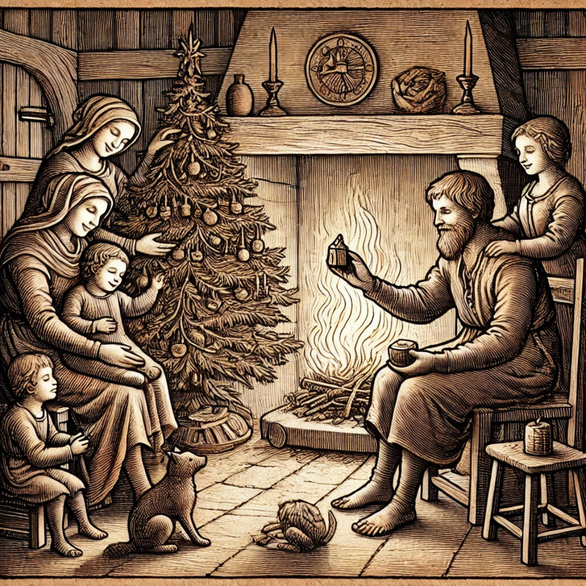
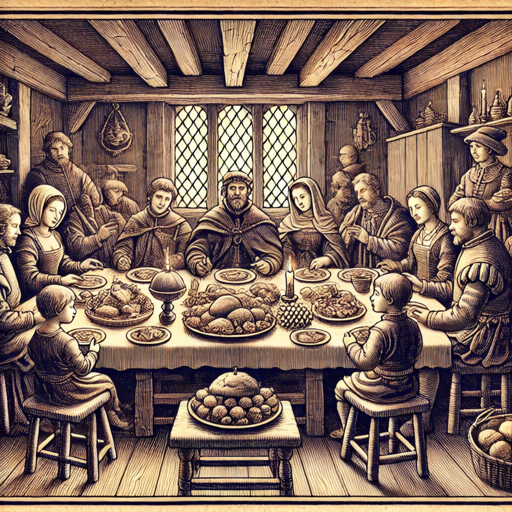

Das Winterfest in Faergria ist ein Fest der Gemeinschaft und der Nächstenliebe, das die kalte Jahreszeit mit Wärme und
Freude erfüllt. Anders als das magisch-spirituelle Julfest, bei dem es um den Kreislauf der Natur und die Rückkehr des
Lichts geht, steht beim Winterfest der Mensch und das Miteinander im Mittelpunkt. Es ist eine Zeit, in der Freundschaft,
Familie und das Teilen gefeiert werden, um die langen Wintertage erträglicher zu machen.

### Kalte Winter in Faergria

Die Ursprünge des Winterfests liegen in der Vergangenheit, als die harten Winter die Gemeinschaften von Faergria auf
eine harte Probe stellten. Die Wintermonate waren oft von Hunger und Einsamkeit geprägt, weshalb die Menschen begannen,
in Glaube und Hoffnung an die lichtbringende Göttin Justicia und die Hohefürstin der Liebe, Avila, sich gegenseitig zu
unterstützen und durch kleine Geschenke und gemeinsame Mahlzeiten Trost zu spenden. Avila, die Verkörperung von
Mitgefühl, Zuneigung und Liebe, lehrte die Menschen, dass wahre Stärke in der gegenseitigen Fürsorge liegt. So wurde das
Winterfest geboren – eine Tradition, die bis heute fortbesteht und das Geben und Teilen in den Vordergrund stellt; heute
auch unabhängig von Glaube und Göttern.

### Das Geben

Im Zentrum des Winterfests steht das Geben. Jede Familie bereitet Geschenke für ihre Liebsten und Nachbarn vor. Diese
Gaben müssen nicht groß oder teuer sein, sondern kommen oft in Form von selbstgemachten Gegenständen oder kleinen,
symbolischen Geschenken, die den Zusammenhalt stärken. Kinder bereiten beispielsweise kleine Puppen oder Spielzeuge aus
Holz vor, während Erwachsene nützliche Gegenstände wie warme Kleidung oder handgemachte Werkzeuge austauschen. Der
Höhepunkt des Winterfests ist dessen Abend, an dem Familien sich in ihren Häusern versammeln, um zu einem besinnlichen
Abendmahl zusammenzukommen, die gemeinsame Zeit mit angeregten Gesprächen zu genießen und anschließend die Gaben
auszutauschen. Dabei geht es weniger um den materiellen Wert der Geschenke als um den Akt des Schenkens selbst. Es ist
Tradition, das beste Stück des Festmahls für jemanden zurückzulegen, der besonders viel Unterstützung braucht – ein
Ausdruck der Nächstenliebe und des Mitgefühls, im Geiste Avilas.

### Zusammenkunft mit Familie und Freunden

Das Winterfest ist eine Zeit, in der die Familie und enge Freunde im Mittelpunkt stehen. Viele Menschen reisen aus allen
Teilen Faergrias zusammen, um in dieser besonderen Zeit mit ihren Liebsten vereint zu sein. Es ist auch eine Zeit, alte
Konflikte beizulegen und sich mit jenen zu versöhnen, mit denen man Streit hatte. Man glaubt, dass das Winterfest die
Herzen erwärmt und Harmonie schafft, die über den Winter hinaus andauert. Neben den familiären Feiern gibt es auch
öffentliche Feste, bei denen das ganze Dorf oder die Stadt zusammenkommt, um gemeinsam zu essen, zu singen und
Geschichten zu erzählen. Diese Zusammenkünfte sollen daran erinnern, dass niemand im Winter alleine sein muss und dass
die Gemeinschaft die Kälte des Winters lindern kann.

### Das Festmahl

Ein weiteres zentrales Element des Winterfests ist das Festmahl. Traditionell bringen die Familien ihre besten Speisen
auf den Tisch, darunter Fleisch, Brot, Obst und Kuchen, die sie teilen. Es ist üblich, dass auch ärmere Mitglieder der
Gemeinschaft eingeladen werden, damit niemand an diesem besonderen Tag hungern muss. Am Abend des Winterfests singen die
Menschen oft Lieder über Freundschaft, Heimat und Zusammenhalt. Es ist auch Brauch, Geschichten von vergangenen
Winterfesten zu erzählen, um die Erinnerungen an vergangene Generationen und deren Gaben zu bewahren.

### Entzünden der Winterlichter

Eine besondere Tradition ist das Anzünden der **Winterlichter**. Diese Kerzen oder Laternen werden in den Fenstern und auf
den Straßen aufgestellt, um symbolisch den Weg für Freunde und Familien zu weisen, die unterwegs sind, aber auch, um an
jene zu erinnern, die nicht mehr unter uns weilen. Das Licht steht für das wärmende Band der Menschlichkeit, das die
Menschen auch in der Dunkelheit des Winters verbindet, ein Symbol der Liebe, das im Geiste Avilas strahlt.

Das Winterfest in Faergria ist nicht nur ein Fest der Freude, sondern auch ein Fest der Nächstenliebe. Es erinnert
daran, wie wichtig es ist, füreinander da zu sein, besonders in Zeiten der Kälte und Dunkelheit. Die Tradition des
Schenkens, des Zusammenkommens und der Versöhnung macht das Winterfest zu einem Höhepunkt des Jahres, der die Menschen
daran erinnert, dass sie gemeinsam stärker sind als die Winterstürme. In der dunkelsten Zeit des Jahres zeigt das
Winterfest, dass die Wärme der zwischenmenschlichen Beziehungen, inspiriert durch die Liebe der Hohefürstin Avila, die
größte Rolle spielt.
